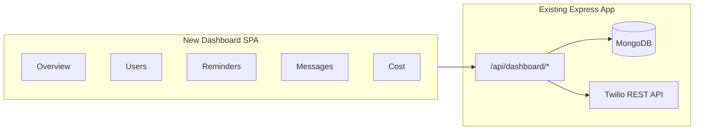

# Analytics Dashboard for WhatsApp Reminders Bot

## Current state

- **Data in MongoDB**: `[users](src/services/mongo.ts)` (phone_number, status, timezone, location, gender, created_at, updated_at), `[reminder_preferences](src/services/mongo.ts)` (user_id, reminder_type, enabled, time_offset_minutes, test_time, last_sent_at, created_at, updated_at).
- **Twilio**: Messages are sent via `[twilio.ts](src/services/twilio.ts)` (`sendMessage`, `sendTemplateMessage`). The app **does not** persist message SIDs, counts, or costs. Status callbacks at `[/webhook/status](src/index.ts)` only log; no DB write.
- **Gaps**: No "all users" list (only `getAllActiveUsers`); no message or cost tracking in DB; no dashboard API or frontend.

---

## Architecture

- **Backend**: Add dashboard API routes to the existing Express app (`[src/index.ts](src/index.ts)`), secured with a shared secret (e.g. `DASHBOARD_API_KEY`).
- **Frontend**: New app in repo (e.g. `dashboard/`) — React + Vite, or Next.js — that consumes the dashboard API. Can be served as static files by Express or deployed separately (e.g. Render static site).

---

## 1. Backend: Dashboard API

### 1.1 Auth

- Require `Authorization: Bearer <DASHBOARD_API_KEY>` or `X-API-Key: <DASHBOARD_API_KEY>` on all dashboard routes.
- Env: `DASHBOARD_API_KEY` (required in production for dashboard).

### 1.2 Mongo extensions

- **Users**: Add `getAllUsers(options?: { status?: string })` and optionally `getUsersCount(filters)` so the dashboard can list all users (active, inactive, pending) and show counts.
- **Reminders**: Add `getAllReminderSettings(options?: { userId?, enabled?, reminderType? })` for listing with filters; you already have `getAllActiveReminderSettings` — either extend that or add a separate aggregation for dashboard (all reminders + user lookup).
- **Aggregations** (new or in a small “stats” module):
  - Users: count by status, count by timezone/location if useful, signups over time (e.g. by day from `created_at`).
  - Reminders: count by type, count enabled vs disabled, last_sent_at distribution.

### 1.3 Message count and cost (Twilio)

- **Option A — Twilio API only (simplest)**  
  - Use [Twilio Usage Records API](https://www.twilio.com/docs/usage/api/usage-record) to get usage by category and date range: message count and cost for WhatsApp (and any other products).  
  - No change to send path or webhook; dashboard backend calls Twilio with cached results (e.g. 5–15 min TTL) to avoid rate limits.  
  - **Limitation**: Only account-level totals per period; no per-user or per-reminder breakdown.
- **Option B — Message log in MongoDB (recommended for “everything”)**  
  - New collection `message_log` (or `outbound_messages`): e.g. `{ phone_number, user_id?, twilio_sid, direction: 'outbound', type: 'template'|'freeform', template_key?, sent_at, status?, error_code? }`.  
  - On every `sendMessage` / `sendTemplateMessage`: after successful send, write one document (phone_number, sid, type, template_key if any, sent_at).  
  - In `/webhook/status`: on status callback, update document by `MessageSid` (map Twilio Sid to log id) to set `status` (and optionally `error_code`).  
  - Dashboard can then show: total messages, messages per day, per user (by phone_number or user_id), by type/template, and delivery status.  
  - Cost can still come from Twilio Usage API (account-level); optionally approximate cost from message count × known rate for display.

Recommendation: **Option B** if you want per-user and per-message-type analytics; **Option A** if you only need account-level message count and cost with minimal code change.

### 1.4 Dashboard API routes (suggested)

| Method | Path                           | Purpose                                                                                                                |
| ------ | ------------------------------ | ---------------------------------------------------------------------------------------------------------------------- |
| GET    | `/api/dashboard/stats`         | Overview: total users, by status; total reminders, by type; messages (today/week/month); cost (from Twilio or cached). |
| GET    | `/api/dashboard/users`         | List users (paginated, optional `status`, `search` by phone).                                                          |
| GET    | `/api/dashboard/users/:id`     | User detail + reminder settings + message count for that user (if using message_log).                                  |
| GET    | `/api/dashboard/reminders`     | List reminders with user info (paginated, optional filters: user_id, type, enabled).                                   |
| GET    | `/api/dashboard/reminders/:id` | Single reminder + user (optional).                                                                                     |
| GET    | `/api/dashboard/messages`      | Message stats: time series (e.g. by day), optional breakdown by type/template; if message_log exists, per-user totals. |
| GET    | `/api/dashboard/usage`         | Cost/usage from Twilio Usage API (cached), optionally with simple breakdown (e.g. by category).                        |

All under a single router (e.g. `src/routes/dashboard.ts`) mounted at `/api/dashboard`, with one auth middleware.

---

## 2. Frontend: Dashboard SPA

### 2.1 Stack

- **React** + **Vite** (or Next.js if you prefer SSR/API route proxy).
- **Routing**: React Router.
- **Data**: TanStack Query (React Query) for API calls, caching, and loading states.
- **Charts**: Recharts or similar (signups over time, messages over time, reminders by type).
- **Tables**: TanStack Table or a simple table with sort/filter for users and reminders.
- **UI**: Tailwind CSS or a small component library (e.g. shadcn/ui) for layout, cards, and forms.

### 2.2 Pages and content

- **Overview**
  - KPI cards: total users, active users, total reminders, messages sent (e.g. today / this month), estimated/cached cost.
  - Charts: signups over time, messages over time, reminders by type (pie/bar).
- **Users**
  - Table: phone_number, status, timezone, location, gender, registered_at, number of reminders, last message sent (if message_log).
  - Filters: status, search by phone.
  - Row click or “View” → user detail: profile fields, list of reminders, message count (and optionally last few sends if you store them).
- **Reminders**
  - Table: user (phone or id), reminder_type, enabled, time_offset_minutes, last_sent_at, test_time, created_at.
  - Filters: type, enabled/disabled, user.
- **Messages**
  - Total sent (today / week / month).
  - Chart: messages over time (by day).
  - If message_log: breakdown by type (template vs freeform) or template key; optional table of recent messages (phone, type, sent_at, status).
- **Cost / Usage**
  - Current period cost and usage from Twilio (cached).
  - Optional: historical curve (if you store daily snapshots or call Twilio for past ranges).

### 2.3 Auth (frontend)

- Single “Dashboard login”: form that sends API key (or username/password that backend validates against env). Store token in memory or sessionStorage; send in `Authorization` (or `X-API-Key`) on every dashboard API request. No need for full OAuth unless you add multiple users later.

### 2.4 Deployment

- Build dashboard to static files (`dashboard/dist` or `dashboard/out`).
- Either: **same service** — Express serves the SPA from a route (e.g. `app.use('/dashboard', express.static('dashboard/dist'))` and fallback `index.html` for client-side routing), or **separate** — deploy the static build to Render/Vercel/Netlify and point it to the same backend API (CORS and `DASHBOARD_API_KEY` in env).

---

## 3. Implementation order

1. **Backend**: Auth middleware + dashboard router; Mongo methods (`getAllUsers`, get-all-reminders with filters, aggregation for stats). Implement `GET /api/dashboard/stats`, `users`, `users/:id`, `reminders`, `reminders/:id` using only MongoDB (no message/cost yet).
2. **Twilio**: Integrate Usage Records in backend (cached); add `GET /api/dashboard/usage` and include message count + cost in `GET /api/dashboard/stats`.
3. **Optional message_log**: Add collection, log in Twilio service + status webhook, then add `GET /api/dashboard/messages` and per-user message count in user detail.
4. **Frontend**: Scaffold app, auth screen, Overview page with KPIs and charts calling the new API.
5. **Frontend**: Users list + detail, Reminders list, Messages page, Cost/Usage page.
6. **Polish**: Error handling, loading states, date range filters, and deployment (Express static or separate host + CORS).

---

## 4. Files to add or change (summary)

| Area                                             | Action                                                                                      |
| ------------------------------------------------ | ------------------------------------------------------------------------------------------- |
| [src/config/index.ts](src/config/index.ts)       | Add `dashboardApiKey` from env (optional in dev).                                           |
| [src/services/mongo.ts](src/services/mongo.ts)   | Add `getAllUsers`, `getAllReminderSettings` (or equivalent), aggregation helpers for stats. |
| New: `src/routes/dashboard.ts`                   | Dashboard router: auth middleware + all GET routes above.                                   |
| New: `src/services/messageLog.ts` (optional)     | Write/update message_log; query by user/date/type.                                          |
| [src/services/twilio.ts](src/services/twilio.ts) | (If Option B) After send, call messageLog.append(...).                                      |
| [src/index.ts](src/index.ts)                     | Mount dashboard router; (if Option B) in `/webhook/status` update message_log by Sid.       |
| New: Twilio usage client                         | Small module to fetch Usage Records (with cache).                                           |
| New: `dashboard/`                                | React + Vite (or Next), pages and components as above.                                      |

---

## 5. Security and env

- **Production**: Require `DASHBOARD_API_KEY`; use HTTPS; do not expose dashboard routes without auth.
- **CORS**: If frontend is on another origin, allow only the dashboard origin in Express CORS config for `/api/dashboard`.
- **Secrets**: Frontend only holds a token (e.g. after “login” with API key); never put Twilio or Mongo credentials in the frontend.

This plan gives you a single place to see users, reminders, message volume, and cost, with the option to add full per-message and per-user analytics via a message log and Twilio status updates.